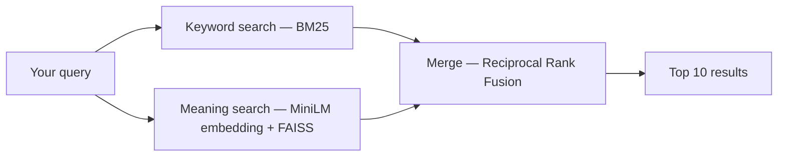

# NewsLens

**Search news by meaning, not just keywords.**

Most search boxes only find text that contains your exact words. Ask for *"companies losing money"* and they miss an article titled *"Firm reports steep deficit"* — same idea, different words. NewsLens fixes that by understanding meaning as well as matching keywords, then blending the two into a single ranked result.


## Why this exists

I built NewsLens to learn how modern search systems actually work under the hood: keyword ranking (BM25), meaning-based retrieval (embeddings + a vector index), and how the two get merged into one result list (Reciprocal Rank Fusion). It's a learning project built on a public research dataset, not a production search engine — see [Scope and limits](#scope-and-limits).

## How it works, in one paragraph

Every article is indexed two ways: a **keyword index** (BM25) that scores exact word matches, and a **meaning index** (a sentence-embedding model + FAISS) that scores how close an article's meaning is to your query. A search runs both, and [Reciprocal Rank Fusion](https://en.wikipedia.org/wiki/Reciprocal_rank_fusion) merges the two ranked lists into one — an article that both methods like rises to the top. The whole thing is served by a small FastAPI backend with a plain HTML/CSS/JS front end.



## Features

- **Three search modes** — Hybrid, Semantic, Keyword — plus a **Compare all** view that shows what each method finds (and misses) side by side
- **Topic filter**, query-term highlighting, **"More like this"** (nearest-neighbour articles), and shareable search URLs
- A hand-written BM25 implementation on sparse matrices (sub-millisecond scoring, no external search engine needed)
- Accessible UI: full keyboard support, screen-reader labels, light/dark themes, responsive layout
- Benchmark and evaluation scripts that measure real latency and search quality — see [Results](#results)

## Quickstart (macOS / Linux)

```bash
git clone https://github.com/<your-username>/newslens.git
cd newslens
./setup.sh                       # one-time: virtual env + dependencies
source venv/bin/activate
scripts/download_dataset.sh      # downloads AG News (120,000 articles, ~29 MB)
python -m backend.ingest         # builds the search index (~5-10 min)
./run.sh                         # open http://127.0.0.1:8000
```

Windows: use WSL, or run the equivalent `pip install -r requirements.txt` / `python -m ...` commands directly.

## Try it

Once it's running, compare how the methods differ:

| Try searching | Keyword search | Semantic / Hybrid |
|---|---|---|
| "companies losing money" | Misses articles that say "firm reports deficit" | Finds them |
| "central bank raises interest rates" | Finds exact phrase matches | Finds paraphrases too |
| A rare name or ticker symbol | Precise | Can be less reliable |

Switch to **Compare all** to see this side by side.

## Dataset

[AG News](https://arxiv.org/abs/1509.01626): 120,000 news articles (title + short description) across 4 topics — World, Sports, Business, Sci/Tech — 30,000 each. Built by Xiang Zhang from the ComeToMyHead news corpus, used as a benchmark in Zhang, Zhao & LeCun, *"Character-level Convolutional Networks for Text Classification"* (NeurIPS 2015). Free for research and non-commercial use. Articles date from around 2004-2005, so this is historical news, not a live feed.

`scripts/download_dataset.sh` fetches it automatically — it is **not** committed to this repo (see `.gitignore`).

## Results

Run these yourself and replace the numbers below:

```bash
python -m backend.benchmark      # latency: p50 / p95 / p99
python -m backend.evaluate       # search quality: precision@10 by method
python -m pytest                 # unit + API tests (8 tests)
```

| Metric | Keyword | Semantic | Hybrid |
|---|---|---|---|
| p95 latency (ms) | 0.4 | 4.7 | 0.7 |
| Queries/sec (single thread) | 4,508 | 252 | 1,981 |
| Topic precision@10 (overall) | 0.90 | 0.95 | 0.93 |

Measured on 50,000 articles, 300 latency queries, 32 quality queries, on a MacBook Pro (single thread, no GPU).

**Note on the quality metric:** precision@10 here uses each article's topic label as a stand-in for relevance (a result "counts" if its topic matches the query's topic). It's a reasonable proxy, not human judgment — see [Scope and limits](#scope-and-limits).

## API

| Endpoint | Purpose |
|---|---|
| `GET /api/search?q=&mode=hybrid\|semantic\|keyword&k=10&category=` | ranked results |
| `GET /api/compare?q=&k=10&category=` | all three modes in one call |
| `GET /api/similar/{id}` | nearest-neighbour articles |
| `GET /api/stats` | index size and model info |

Interactive docs at `/docs` once the server is running.

## Design decisions

- **Why hybrid, not just semantic?** BM25 is precise for exact terms, names and numbers; embeddings handle paraphrase and synonyms. Combining them covers more cases than either alone.
- **Why Reciprocal Rank Fusion?** BM25 scores and cosine similarities live on different scales. RRF merges by *rank* instead, so no score normalization or tuning is needed.
- **Why HNSW (approximate search)?** It scales sub-linearly as the collection grows. An exact (`--index flat`) option is available for comparison.
- **Why a hand-written BM25?** Off-the-shelf pure-Python BM25 libraries score documents in slow loops. Pre-computing BM25 weights into a sparse matrix turns a query into a fast matrix operation — sub-millisecond even at 120K documents.

## Scope and limits

This is a learning project, not a production search engine or a Google competitor:

- No web crawler — it searches a fixed, pre-collected dataset, not the live web
- The dataset is small (120K articles), old (2004-2005), and has only 4 broad topics
- Search-quality evaluation uses topic labels as a relevance proxy, not human judgments
- Single machine, no authentication, no live index updates
- Real-world uses of this same technique: search over a company's internal documents or support articles, retrieval for an AI assistant answering questions from private data, "similar item" recommendations

## Project layout

```
backend/   config, bm25, ingest, engine, main (API), benchmark, evaluate
frontend/  index.html, styles.css, app.js
tests/     unit and API tests
scripts/   download_dataset.sh
data/      generated index files (git-ignored, built by ingest.py)
```

## Built with

Python, FastAPI, [sentence-transformers](https://www.sbert.net/) (all-MiniLM-L6-v2), [FAISS](https://github.com/facebookresearch/faiss), scikit-learn, NumPy/SciPy. Parts of the initial scaffolding were written with an AI coding assistant; the design, testing and evaluation are my own.

## License

MIT — see [LICENSE](LICENSE). The AG News dataset has its own terms (research / non-commercial use).
